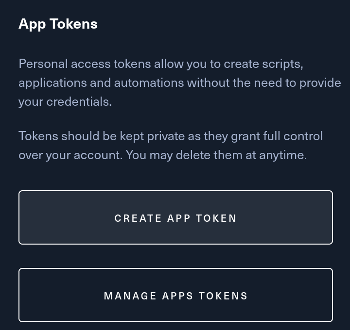

# HTB-University-Completion-Tracker
A simple python script to track the completion of challenges, boxs and fortresses of universities on HackTheBox website.

This script is originally created for the [GCC](https://gcc-ensibs.fr/) team representing the French University ENSIBS.

<p align="center">
	<a href="https://gcc-ensibs.fr/"></a>
	<a href="https://www-ensibs.univ-ubs.fr/fr/index.html"></a>
</p>

## How to use
### Help
```
python3 HTB-University-Completion-Tracker.py -h
```
```
usage: HUCT - HTB University Completion Tracker [-h] [-q] university_id api_key

A simple python script to track the completion of challenges, boxs and fortresses of universities on HackTheBox
website.

positional arguments:
  university_id  The university id you want to track the completion of.
  api_key        The HTB api key (Profile -> Settings -> App Tokens). Tips: Use $(cat .api_key)

options:
  -h, --help     show this help message and exit
  -q, --quiet    Remove all informational prints

Made with love for GCC-ENSIBS by Drahoxx 🫶

```

### First run
1. Get your HTB app token
Profile -> [Settings](https://app.hackthebox.com/profile/settings) -> App Tokens -> Create App Token
<a href="https://app.hackthebox.com/profile/settings"></a>

2. Put the token in a file (here `../api_htb.sec`)
```sh
echo -n "eyJ0eXAiOiJKV1QiLCJh...4P25g" > ../api_htb.sec
```

3. Get your university id
Go to https://app.hackthebox.com/universities/ and click on `My University`.

The URL of the new tab should look like `https://app.hackthebox.com/universities/overview/518`, meaning 518 is the id of our university (here ENSIBS).

4. Enjoy !
```sh
python3 HTB-University-Completion-Tracker.py 518 $(cat ../api_htb.sec)
```

## Output example

Output of the script for ENSIBS University (id 518) the 5 dec. 2023. 
```
----------------------------------------
MACHINES THAT AREN'T OWN BY UNIVERSITY
552 -- RegistryTwo -- Insane
544 -- Bookworm -- Insane

----------------------------------------
CHALLENGES THAT AREN'T FLAGGED BY UNIVERSITY
Pwn -- Oxidized ROP -- Easy
Pwn -- What does the f say? -- Medium
Pwn -- Antidote -- Medium
Pwn -- Kernel Adventures: Part 2 -- Medium
Pwn -- Arms roped -- Medium
Pwn -- Login Simulator -- Medium
Pwn -- Fancy names -- Medium
Pwn -- Dragon Army -- Medium
Pwn -- Ancient Interface -- Medium
Pwn -- Scanner -- Medium
Pwn -- CFI++ -- Hard
Pwn -- Fake Snake -- Hard
Pwn -- Unsighted -- Hard
Pwn -- Kryptor -- Insane
Pwn -- Quantum Memory Manager -- Insane
Pwn -- NFTDRM -- Insane
Pwn -- Kryptor 2 -- Insane

Reverse -- Up a Stream -- Easy
Reverse -- Iterative Virus -- Medium
Reverse -- PTRACE_NOPEEKING -- Medium
Reverse -- FFModule -- Medium
Reverse -- RetoRetro -- Medium
Reverse -- vmcrack -- Hard
Reverse -- ReRop -- Hard
Reverse -- Substandard Optimization -- Insane

Hardware -- Prison Escape -- Medium
Hardware -- Bare Metal -- Medium
Hardware -- Secret Treasures -- Medium
Hardware -- Project Power -- Medium

Web -- TwoDots Horror -- Medium
Web -- Prying Eyes -- Medium
Web -- Pod Diagnostics -- Hard
Web -- Why Lambda -- Hard
Web -- OOPArtDB -- Insane

Misc -- Touch -- Easy
Misc -- Vipère -- Medium
Misc -- Triangles -- Medium
Misc -- Thief -- Medium
Misc -- Noisy -- Medium

Mobile -- SAW -- Medium
Mobile -- Waiting -- Medium
Mobile -- Angler -- Medium
Mobile -- Joker -- Hard
Mobile -- Pedometer -- Hard

GamePwn -- NoRadar -- Easy
GamePwn -- CubeBreaker -- Medium
GamePwn -- InfiniteDoge -- Medium
GamePwn -- NoMap3D -- Medium
GamePwn -- NoClip -- Medium

Crypto -- Twisted Entanglement -- Medium
Crypto -- Protein Cookies 2 -- Medium
Crypto -- AliEnS -- Medium
Crypto -- Quadratic Points -- Medium
Crypto -- Wonky AES -- Insane

Blockchain -- Portal Noncense -- Medium
Blockchain -- Locked and Loaded -- Medium


----------------------------------------
FORTRESS THAT AREN'T OWN BY UNIVERSITY
7 -- AWS
```

## Disclaimers
No Warranty: THE SUBJECT SCRIPT IS PROVIDED "AS IS" WITHOUT ANY WARRANTY OF ANY KIND. Besides HackTheBox might change their api links causing fatal errors.